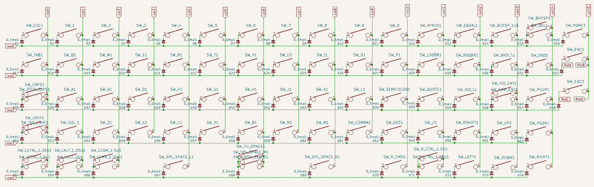
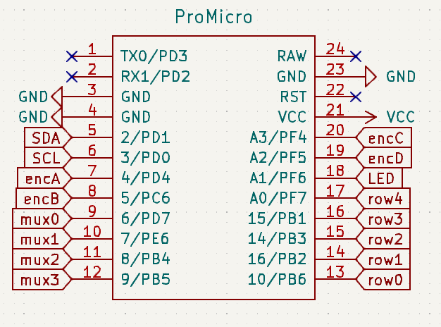
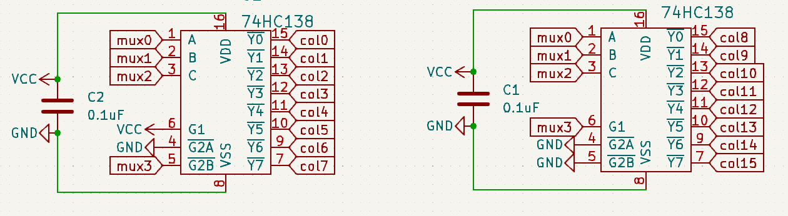

# lagom PCBs
Lagom is an easy to build 65% keyboard using only through hole components. It uses a separate microcontroller (like the Pro Micro, Elite C or something RP2040 based) to enable flexibility in firmware and connectivity and to further simplify the soldering experience (no more tricksy USB ports). Demultiplexers and a custom matrix are used to enable the size and features of the board with only the pinouts of a pro micro. 

**Lagom kits are available for sale at [sthlmkb.com](https://sthlmkb.com/shop/lagom-keyboard-kit/)**

[License](LICENSE)

Lagom is licensed under the [Creative Commons Attribution-NonCommercial 4.0 International license](https://creativecommons.org/licenses/by-nc/4.0/). This design as it stands in this repository may be freely reproduced, modified, and manufactured for PERSONAL USE ONLY and may not be reproduced in physical form for public sale. 

## Designs that are here:
* Lagom (i.e this directory) - this is the main PCB
* Lagom Plate (`lagom_plate`) - this is the plate that holds the switches and goes above the PCB
* Lagom Base (`lagom_base`) - this is the base of the board and goes below the PCB
* Lagom Window (`lagom_window`) - this is an optional design for an acrylic window that covers the diodes and the controller

## Some useful images/documentation:

This the key layout and all option layouts exported from keyboard-layout-editor

This the layout of the matrix used

This the pinout of the pro micro or pro micro compatible controller

This is the pinout of the demuxes used in Lagom to enable all the columns to work on a pro micro pinout
