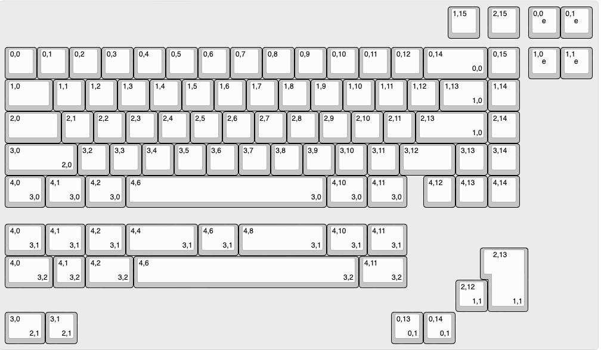
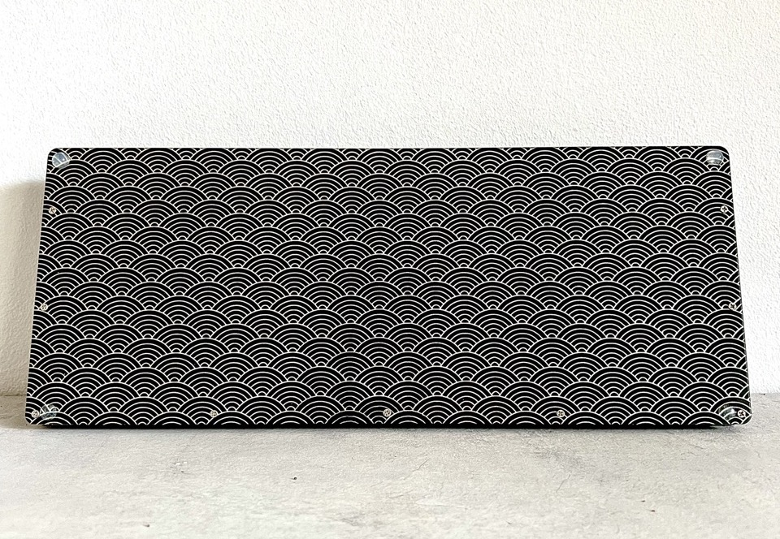
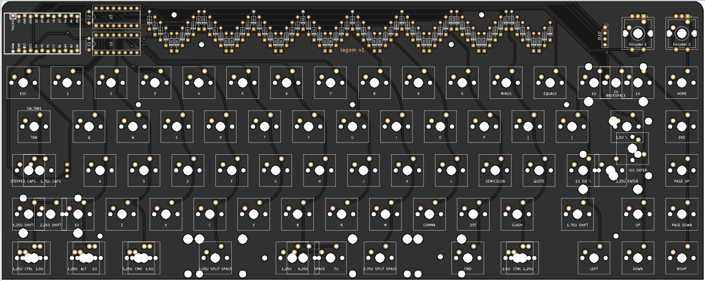

# lagom
Lagom is an easy to build 65% keyboard using only through hole components. It uses a separate microcontroller (like the Pro Micro, Elite C or something RP2040 based) to enable flexibility in firmware and connectivity and to further simplify the soldering experience (no more tricksy USB ports). Demultiplexers and a custom matrix are used to enable the size and features of the board with only the pinouts of a pro micro. 

Lagom kits are available for sale at [sthlmkb.com](https://sthlmkb.com/shop/lagom-keyboard-kit/)

[License](LICENSE)

Lagom is licensed under the [Creative Commons Attribution-NonCommercial 4.0 International license](https://creativecommons.org/licenses/by-nc/4.0/). This design as it stands in this repository may be freely reproduced, modified, and manufactured for PERSONAL USE ONLY and may not be reproduced in physical form for public sale. 

## Features
* Only through hole components for easy soldering
* Separate microcontroller using Pro micro, Elite C, Nice! Nano or equivalent footprint. So micro USB, USB-C or Bluetooth are all options!
* 2 rotary encoders
* OLED screen
* Optional underglow RGB lighting with a WS2812b light strip
* Multiple layout options including ISO, ANSI, split space (2.25u + 1.25u + 2.75u), 7u space, split left shift (1.25u + 1u) and stepped capslock ([layout]("http://www.keyboard-layout-editor.com/##@_name=Lagom&notes=16%20cols%20%2F=%204%20pins%20with%202x%203%20to%208%20demux%20(2%5E4%20%2F=%2016)%0A5%20rows%0A11%20pins%20total%20for%20keyswitches%0A16%20+%202%20pins%20(for%20OLED)%20on%20a%20pro%20micro%0A1%20pin%20for%20LED%20underglow%0A4%20pins%20for%202%20encoders%0A%0A72%20keys%20+%202%20enc%20%3B&@_x:13.75%3B&=1,15&_x:0.25%3B&=2,15&_x:0.25%3B&=0,0%0A%0A%0A%0A%0A%0A%0A%0A%0Ae&=0,1%0A%0A%0A%0A%0A%0A%0A%0A%0Ae%3B&@_y:0.25%3B&=0,0&=0,1&=0,2&=0,3&=0,4&=0,5&=0,6&=0,7&=0,8&=0,9&=0,10&=0,11&=0,12&_w:2%3B&=0,14%0A%0A%0A0,0&=0,15&_x:0.25%3B&=1,0%0A%0A%0A%0A%0A%0A%0A%0A%0Ae&=1,1%0A%0A%0A%0A%0A%0A%0A%0A%0Ae%3B&@_w:1.5%3B&=1,0&=1,1&=1,2&=1,3&=1,4&=1,5&=1,6&=1,7&=1,8&=1,9&=1,10&=1,11&=1,12&_w:1.5%3B&=1,13%0A%0A%0A1,0&=1,14%3B&@_w:1.75%3B&=2,0&=2,1&=2,2&=2,3&=2,4&=2,5&=2,6&=2,7&=2,8&=2,9&=2,10&=2,11&_w:2.25%3B&=2,13%0A%0A%0A1,0&=2,14%3B&@_w:2.25%3B&=3,0%0A%0A%0A2,0&=3,2&=3,3&=3,4&=3,5&=3,6&=3,7&=3,8&=3,9&=3,10&=3,11&_w:1.75%3B&=3,12&=3,13&=3,14%3B&@_w:1.25%3B&=4,0%0A%0A%0A3,0&_w:1.25%3B&=4,1%0A%0A%0A3,0&_w:1.25%3B&=4,2%0A%0A%0A3,0&_w:6.25%3B&=4,6%0A%0A%0A3,0&_w:1.25%3B&=4,10%0A%0A%0A3,0&_w:1.25%3B&=4,11%0A%0A%0A3,0&_x:0.5%3B&=4,12&=4,13&=4,14%3B&@_y:0.5&w:1.25%3B&=4,0%0A%0A%0A3,1&_w:1.25%3B&=4,1%0A%0A%0A3,1&_w:1.25%3B&=4,2%0A%0A%0A3,1&_w:2.25%3B&=4,4%0A%0A%0A3,1&_w:1.25%3B&=4,6%0A%0A%0A3,1&_w:2.75%3B&=4,8%0A%0A%0A3,1&_w:1.25%3B&=4,10%0A%0A%0A3,1&_w:1.25%3B&=4,11%0A%0A%0A3,1%3B&@_y:-0.25&x:15&w:1.25&h:2&w2:1.5&h2:1&x2:-0.25%3B&=2,13%0A%0A%0A1,1%3B&@_y:-0.75&w:1.5%3B&=4,0%0A%0A%0A3,2&=4,1%0A%0A%0A3,2&_w:1.5%3B&=4,2%0A%0A%0A3,2&_w:7%3B&=4,6%0A%0A%0A3,2&_w:1.5%3B&=4,11%0A%0A%0A3,2%3B&@_y:-0.25&x:14%3B&=2,12%0A%0A%0A1,1%3B&@_w:1.25%3B&=3,0%0A%0A%0A2,1&=3,1%0A%0A%0A2,1&_x:9.75%3B&=0,13%0A%0A%0A0,1&=0,14%0A%0A%0A0,1"))
* Open and visible components (in the style of Plaid, Romac etc)
* Simple, beautiful and flexible sandwich case out of FR4 (pcb material)

## Components required 
* PCB
* FR4 Switch plate
* FR4 Base 
* Controller (I used a Pro Micro in the guide but anything that shares the footprint and pinout will be fine e.g. Elite C, Nice! Nano, or something RP2040 powered!)
* Diodes 1N4148 (74)
* 0.1μF Capacitor (2)
* 16 pin IC socket (2)
* IC (74HC138N) demultiplexer (2)
* Switches (5 pin MX footprint) (up to 72 depending on layout)
* Rotary encoders (2)
* Rotary encoder knobs (2)
* 0.91" OLED screen
* 10mm M2 Standoffs (9 required if mounting the base to the plate)
* 6mm x M2 screws for attaching the standoffs to the plate/base (2 per standoff so 18 total)
* Acrylic cover for the components at the top (optional, not included)
* Stabilisers (PCB mount) (5 x 2u or 3 x 2u + 6.25u or 3 x 2u + 7u depending on layout)
* Rubber feet for the base

[Build guide available here](build_guide.md)

## Known issues 
None yet! 
