# Lagom build guide

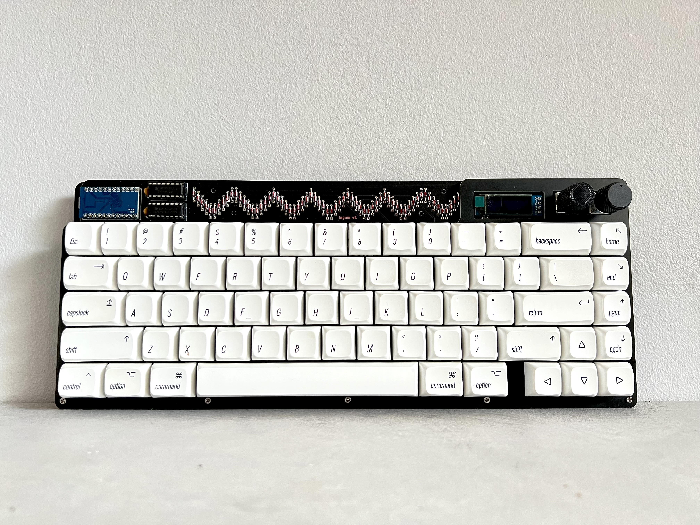

## Components required 

* PCB
* FR4 Switch plate
* FR4 Base 
* Controller (I used a Pro Micro in the guide but anything that shares the footprint and pinout will be fine e.g. Elite C, Nice! Nano, or something RP2040 powered!)
* Diodes 1N4148 (74)
* 0.1μF Capacitor (2)
* 16 pin IC socket (2)
* IC (74HC138N) demultiplexer (2)
* Switches (5 pin MX footprint) (up to 72 depending on layout)
* Rotary encoders (2)
* Rotary encoder knobs (2)
* 0.91" OLED screen
* 10mm M2 Standoffs (9 required if mounting the base to the plate)
* 6mm x M2 screws for attaching the standoffs to the plate/base (2 per standoff so 18 total)
* Acrylic cover for the components at the top (optional, not included)
* Stabilisers (PCB mount) (5 x 2u or 3 x 2u + 6.25u or 3 x 2u + 7u depending on layout)
* Rubber feet for the base

## You will also need

* Soldering iron
* Solder
* Diode bender (helpful but not required, I used [this one](https://www.printables.com/model/23523-1n4148-diodes-bending-jig))
* A small amount of electrical tape for the backside of the OLED

## Before you begin!

Please double check everything and that you have all the parts! If you ordered a kit there is a very slim chance we forgot something or that your order is wrong; in the case this is true, please reach out via email at hej at sthlmkb.com and we will work with you to make it right. 

Due to the DIY nature of this hobby, as soon as a soldering iron touches or other modifications happen to the board, I am no longer able to issue a refund/replacement. 

Note about this guide: For this guide, I am building a board with a Pro Micro, 2 encoders and an OLED - yours may differ. You are free to adjust or skip steps if they do not apply to your scenario.

All that being said, let's get started!

## Step by step

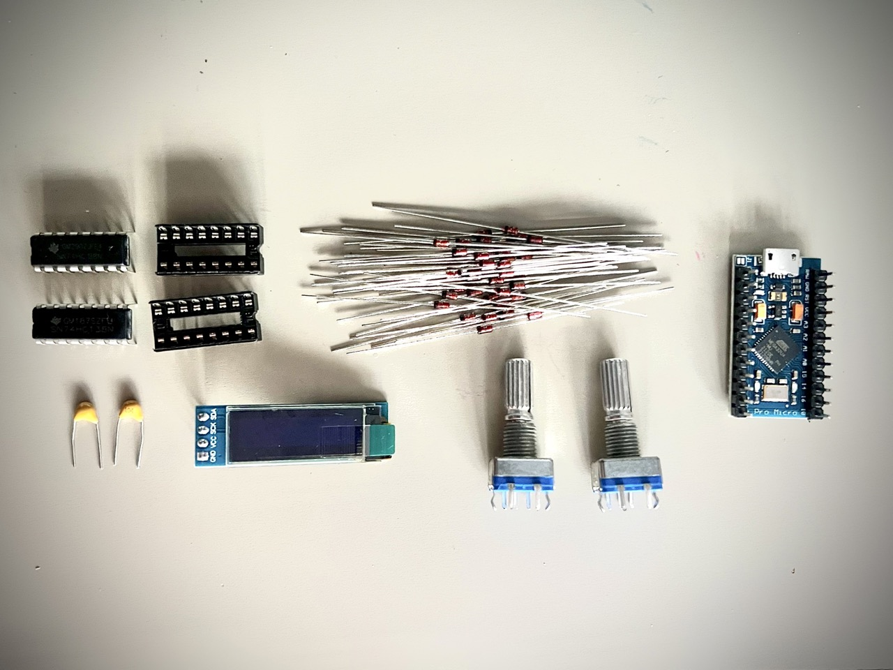
1. Check that you have all the components you need.

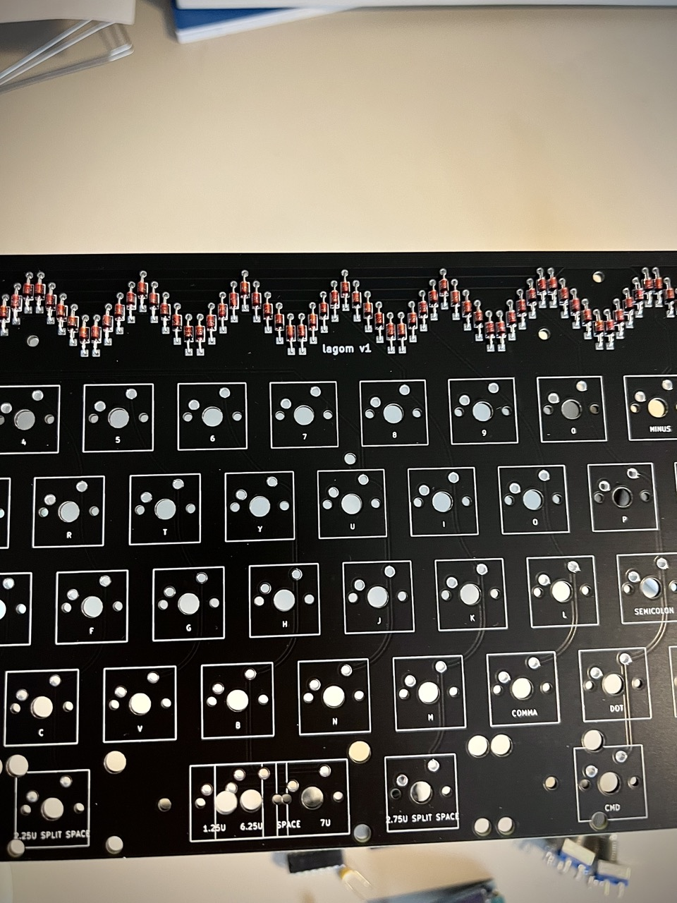
2. Start by bending all the diodes (I used the 3d printed diode bender above). And then place them in the sockets, ensuring that you have the *correct orientation*, the black line on the diode should match the white lines on the board. I then placed some tape over the diodes to hold them in place while I flipped over the board to solder them.

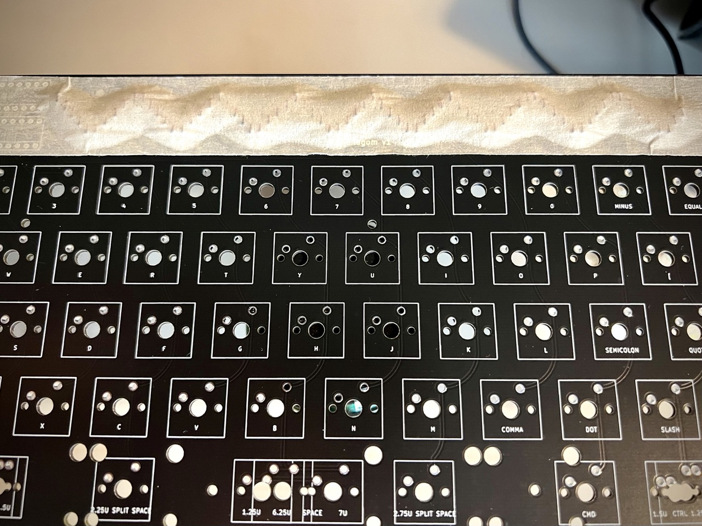
3. Solder the diodes on (I soldered on the underside of the board) and trim their legs once the solder has cooled

4. Solder the 2 capacitors to the PCB. They should sit on the top side of the PCB (like the diodes). Orientation does not matter with them.

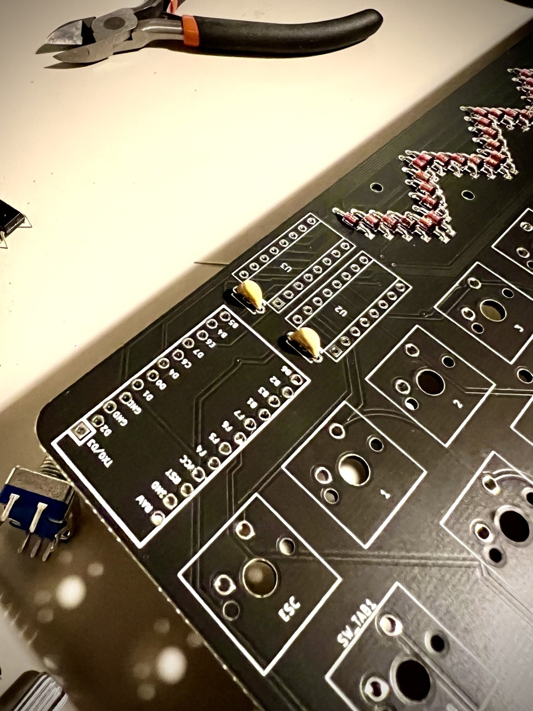
5. Solder the 2 IC sockets to the PCB. They have a notch on them and the notch should be aligned with the notch on the footprint (pointing towards the capacitors). Do *not* place the ICs in the sockets yet. 

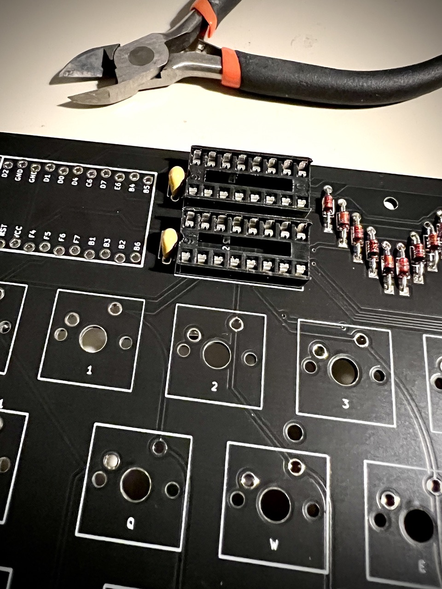
6. Solder the two rotary encoders to the board. They should only fit one way, ensure that you don't bend any of the pins when doing so.

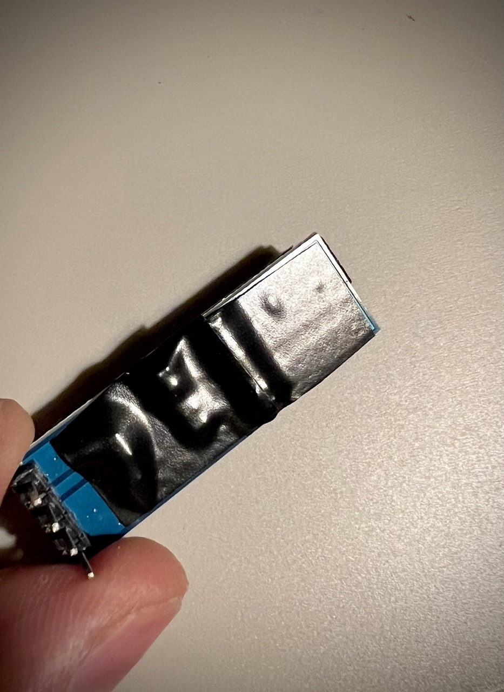

7. Cut a small section or two of electrical tape and place it on the back of the OLED screen to cover up the resistors and other surface mount components there. This is to ensure that they do not short with the diodes when placed on top of them.
8. Solder the OLED screen in place. The screen should be facing to the left and the ground pin of the OLED should be at the top of the board. The orientation matters here, but realistically it's hard to get it wrong as the encoders will be in the way. If you're planning on adding RGB underglow with a light strip (e.g. a WS2812b compatible one) then this is could be a good time to solder a socket to the 3 holes to make it easier for later (but it's possible to mod this later if you want to).
9. Flash your controller and check that it is working as expected (e.g. when you plug it into the computer it is recognised as a USB keyboard device). See flashing instructions [here](https://sthlmkb.com/2022/06/flashing-your-microcontroller/).
10. Solder your controller to the board. The board has offset holes so that hotswapping might work, but this didn't go so great in practice so I just soldered my controller on. You are of course very welcome to socket your controller too if you value switchability. I soldered headers onto my controller and then soldered everything onto the PCB and then trimmed the legs on the underside of the PCB. *Orientation matters* here so ensure that you have the controller in the right position. With a pro micro this is facing down so the USB port is wedged between the Pro Micro and the PCB.

11. Insert the ICs into the sockets (be careful of the legs and do not bend them). Now you should be able to plug in your board and test that all keystrokes are recognised. I used a pair of tweezers or a switch to short the switch sockets for this. 	

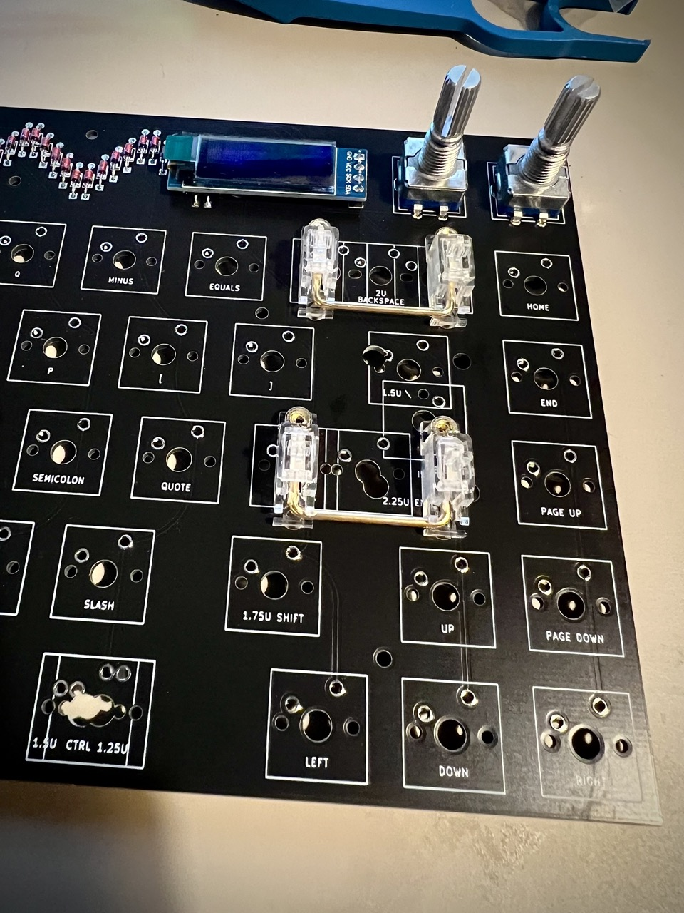
12. Add the stabilisers. Hopefully by now you should know what layout you want, but if you don't then now's a good time to choose! I used some Glorious GOAT PCB mounted screw in stabs in the photos. If you want to mod and/or lube your stabs then this is the time!

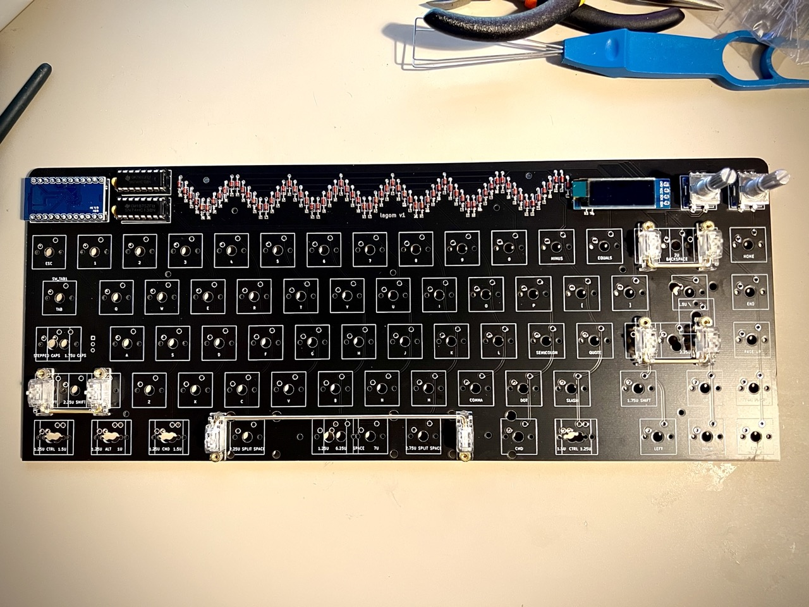
13. Start by placing a couple switches in the corners of the plate and then attach the plate to the PCB ensuring that you don't bend any pins while doing so. Ensure that the rotary encoders and the OLED screen are fitting correctly once you place the plate on top.

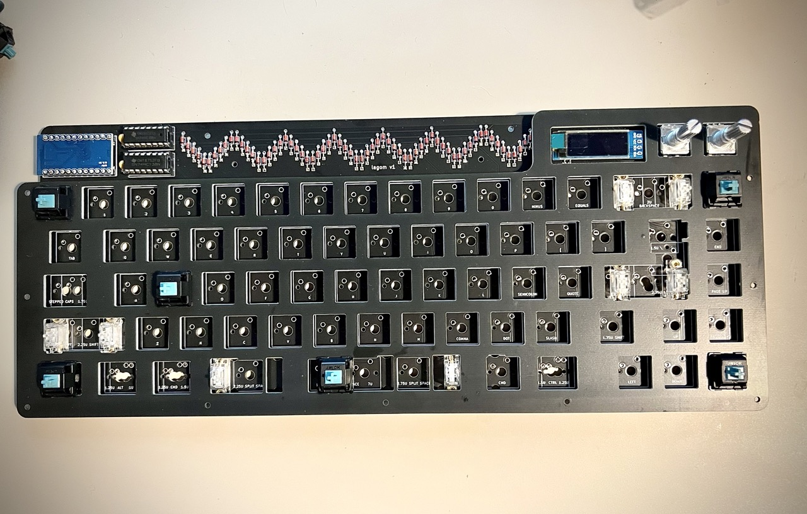
14. Continue placing the rest of the switches until all keys are present. I used JWick T1 Tactile switches in the photos and went with the standard ANSI layout with a 6.25u space bar.

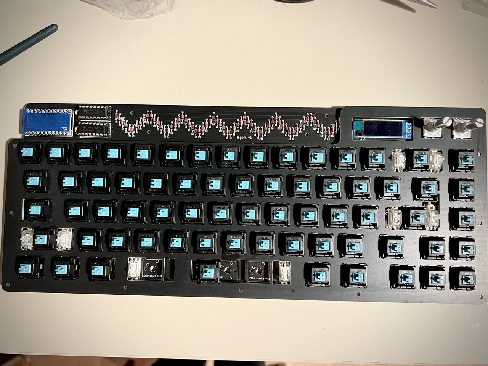
15. Double check that your stabilisers are all correct (i.e. the wires are seated securely) and lubed as there's no going back once you've soldered switches in. Check again that that none of the switch pins are bent and not poking through the holes. They're a pain to fix once you've started soldering the switches.

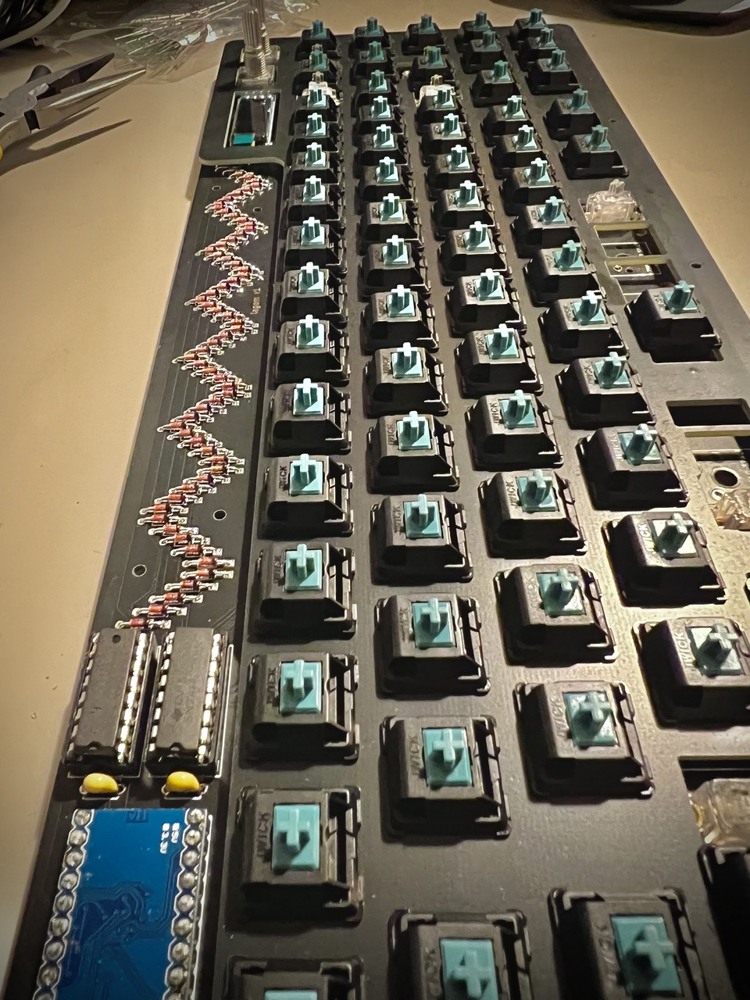
16. Start soldering all the switches in place. Double check that you've not missed anything (it's easy to overlook a few switches).
17. Attach the standoffs to the screws on the edges of the switch plate and position the base plate correctly and screw in the screws from the bottom too. Add the rubber bumbers to the base plate in the corners. The larger ones go at the top so that you get a slight  typing angle.
18. Add some keycaps and encoder knobs and *you are done!* Have a test that everything's working as expected and maybe update/flash some new firmware if you feel like it. Enjoy!

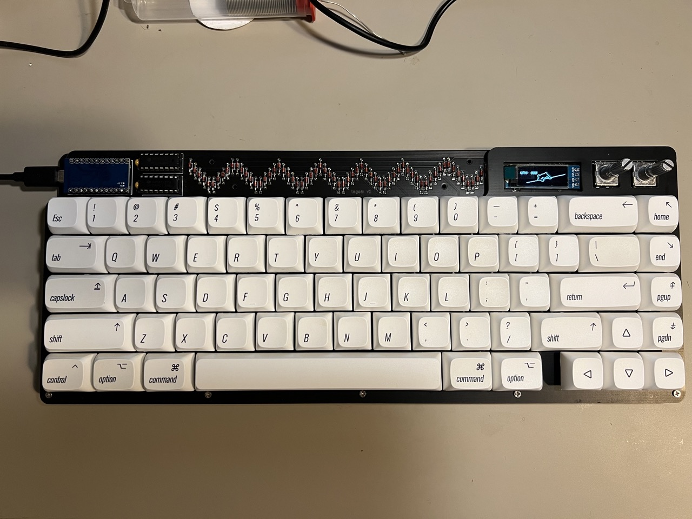