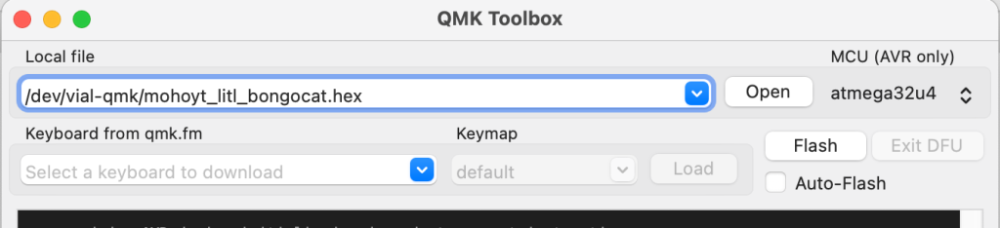
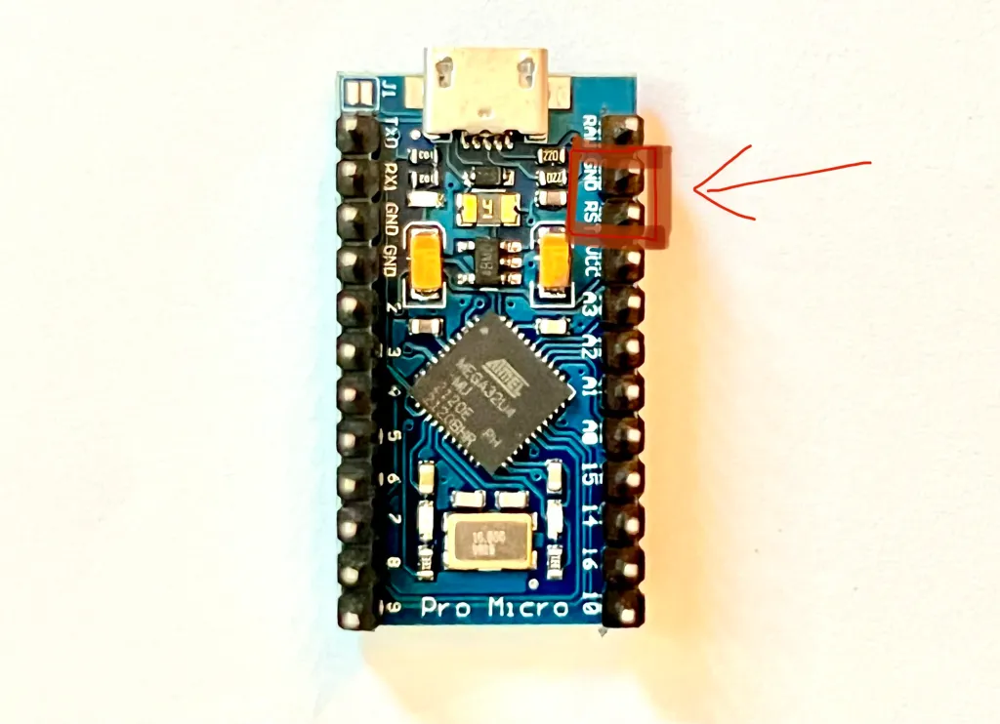
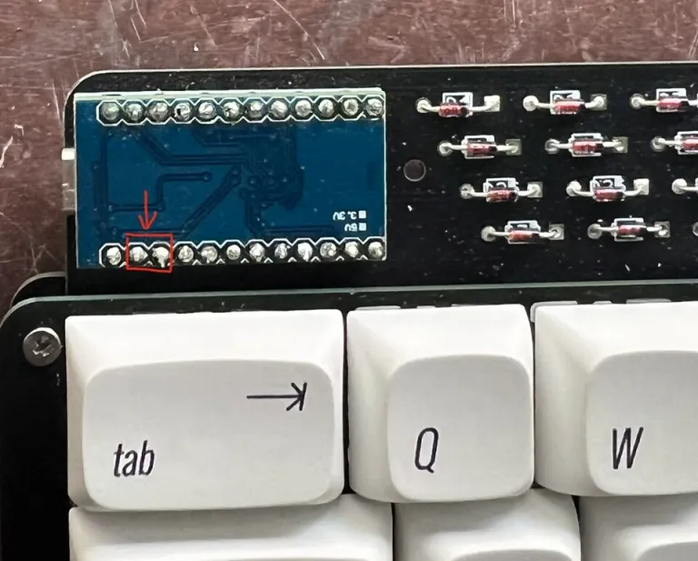
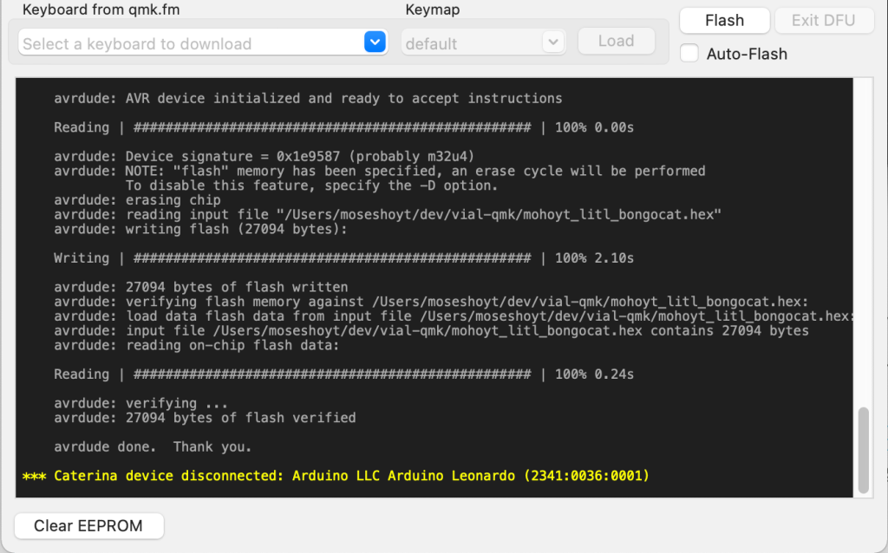

# Pro Micro Microcontroller Flashing Guide

You’ve built your keyboard and now you want to make it work. To do this you’ll have to flash your microcontroller.

The exact specfics of how you do this depend on the microcontroller that you’re using, so take a look at their specific documentation. I will go through the process of flashing a Pro Micro conroller here.

## Step by step

1. You’ll need a compiled firmware file. This is something that you might have downloaded from where you bought your keyboard, or something that you configured and built yourself. It’s a file that has a .hex file format. We have precompiled firmware files for Lagom [here](https://github.com/mohoyt/lagom/releases).

2. Download and install QMK Toolbox from their Github page: https://github.com/qmk/qmk_toolbox

3. Open QMK Toolbox and connect your keyboard or controller to your computer over USB. You might see something in the QMK console when you connect it, but not always.

4. Press open at the top of the QMK configurator window and choose the .hex file that you want to flash to your microcontroller. Precompiled (and Vial compatible) hex files for the Lagom are available [here on our Github](https://github.com/mohoyt/lagom/releases). If you want to be able to configure your keyboard using Vial (recommended) then make sure to flash one of the vial hex files. Ensure that the file that you’re trying to flash has the file format .hex as sometimes browsers will download these files oddly. 

5. Ensure that you have the correct MCU chosen at the top right of the QMK Toolbox window. For a Pro Micro it is an atmega32u4

6. Now comes the slightly tricky bit. You’ll need something metal to short two of the pins on the microcontroller. You can use pliers, a piece of wire or even a pen. You want to briefly connect and then disconnect the RESET and the GROUND pins of the Pro Micro. These are the second and third pins on the right hand side when the components are facings towards you and the usb port is facing up.

If you’re flashing the controller once it’s already soldered on the keyboard then you will need to short the same pins but likely from the other side. It’s the two pins pictured in the image below.

7. If you’ve successfully connected the pins and then disconnected them you should see a yellow line in the QMK Toolbox console like this. The line might say something slightly different depending on your controller.

8. Once you see the yellow line, you need to press Flash within 5 seconds. There will be lots of text rendered on the console when you do this, but it will ultimately say something like avrdude done. Thank you  and then will print another yellow disconnect line if it succeeds.

9. If you’ve flashed the QMK firmware then your keyboard should be good to go right away. If you flashed the Vial firmware then your keyboard should work right away too, but if you want to configure layers then you will have to download Vial.

## You did it! Nice one. 

Any feedback or challenges with the build process? Get in touch with us at hej at sthlmkb.com