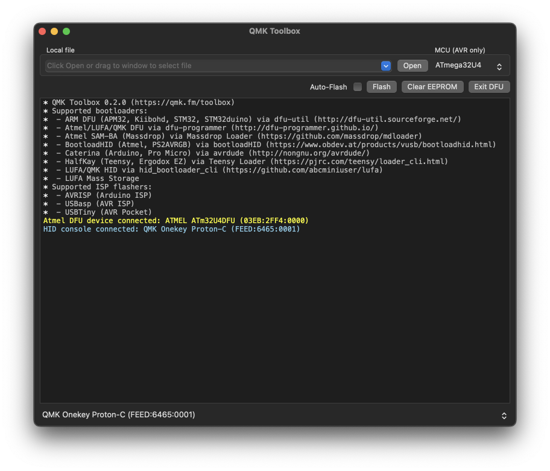
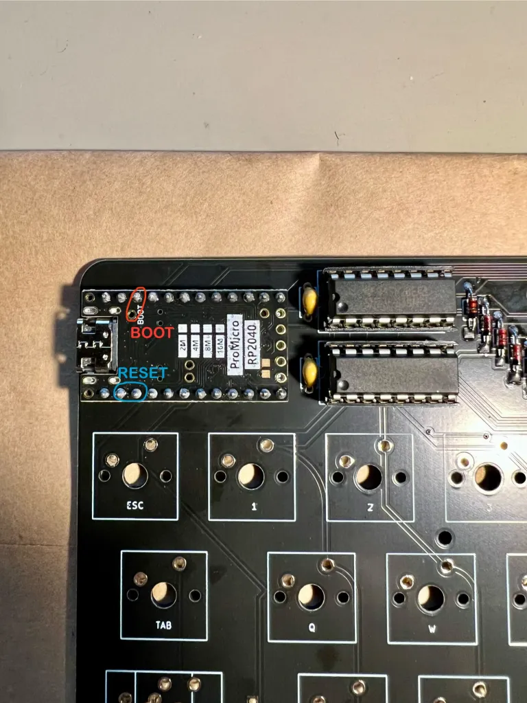

# Pro Micro Microcontroller Flashing Guide

You’ve built your keyboard and now you want to make it work. To do this you’ll have to flash your microcontroller.

The exact specfics of how you do this depend on the microcontroller that you’re using, so take a look at their specific documentation. I will go through the process of flashing a Pro Micro conroller here. The instructions assume that you’re flashing a ‘traditional’ atmel based Pro Micro, but if you are flashing a RP2040 variant then scroll down to the lower section of this page.

## Atmel ‘Traditional’ Pro Micro Flashing

1. You’ll need a compiled firmware file. This is something that you might have downloaded from where you bought your keyboard, or something that you configured and built yourself. It’s a file that has a .hex file format. We have precompiled firmware files for Lagom [here](https://github.com/mohoyt/lagom/releases) and some notes on compiling [here](https://github.com/mohoyt/lagom/firmware).

2. Download and install QMK Toolbox from their Github page: https://github.com/qmk/qmk_toolbox

3. Open QMK Toolbox and connect your keyboard or controller to your computer over USB. You might see something in the QMK console when you connect it, but not always.

4. Press open at the top of the QMK configurator window and choose the .hex file that you want to flash to your microcontroller. Precompiled (and Vial compatible) hex files for the Lagom are available [here on our Github](https://github.com/mohoyt/lagom/releases). If you want to be able to configure your keyboard using Vial (recommended) then make sure to flash one of the vial hex files. Ensure that the file that you’re trying to flash has the file format .hex as sometimes browsers will download these files oddly. 

5. Ensure that you have the correct MCU chosen at the top right of the QMK Toolbox window. For a Pro Micro it is an atmega32u4

6. Now comes the slightly tricky bit. You’ll need something metal to short two of the pins on the microcontroller. You can use pliers, a piece of wire or even a pen. You want to briefly connect and then disconnect the RESET and the GROUND pins of the Pro Micro. These are the second and third pins on the right hand side when the components are facings towards you and the usb port is facing up.

If you’re flashing the controller once it’s already soldered on the keyboard then you will need to short the same pins but likely from the other side. It’s the two pins pictured in the image below.

7. If you’ve successfully connected the pins and then disconnected them you should see a yellow line in the QMK Toolbox console like this. The line might say something slightly different depending on your controller.

8. Once you see the yellow line, you need to press Flash within 5 seconds. There will be lots of text rendered on the console when you do this, but it will ultimately say something like avrdude done. Thank you  and then will print another yellow disconnect line if it succeeds.

9. If you’ve flashed the QMK firmware then your keyboard should be good to go right away. If you flashed the Vial firmware then your keyboard should work right away too, but if you want to configure layers then you will have to download Vial.

## RP2040 Pro Micro Flashing

1. You’ll need a compiled firmware file. This is something that you might have downloaded from where you bought your keyboard, or something that you configured and built yourself. It’s a file that has a .uf2 file format. We have precompiled firmware files for Lagom [here](https://github.com/mohoyt/lagom/releases) and some notes on compiling [here](https://github.com/mohoyt/lagom/firmware).

2. You now need to plug it in with USB to your computer and get the RP2040 Pro Micro to enter bootloader mode.

The RP2040 will be in bootloader mode when a RPI-RP2 volume appears on your computer.

There are a number of ways of doing this. Ranked from easy to most tricky:

* If you have a brand new RP2040 Pro Micro, many times it will start up for the first time in bootloader mode. But if not, read on.
* If you have a built keyboard – hold down the bootloader key while you plug in the keyboard.
    * This is the easiest way to get into the bootloader. But it only works if the controller is already flashed with QMK or Vial. The key you would need to hold down is the key is the first key on the first column. 99% of the time that’s the escape key.
* If you have the Pro Micro unconnected to a keyboard or the reset button easily accessible – double tap the reset button on the Pro Micro RP2040.
    * Like the method above this only works if it is already flashed with QMK. This is a little bit more annoying than holding down a key because you may need to open your keyboards case to gain access to your reset switch.
    * If there is no reset button then you can short the RST pin and a GND pin twice in quick succession.
* Hold down the boot button on the Pro Micro RP2040 while you plug in your keyboard.
    * The Pro Micro RP2040 has 2 buttons on it, boot and reset. Hold boot in while connecting via USB
    * You can also short the BOOT pin and a GND pin while plugging in the keyboard too
* Hold down boot switch while you tap your reset switch.
    * If you have access to both BOOT and RESET switches (e.g. if you’ve not soldered on the Pro Micro yet) you simply hold down the boot switch while you tap and let go of the reset switch.
    * You can also short and hold the BOOT pin and a GND pin while shorting RST and a GND pin to achieve the same thing.

*You will know that these work when a RPI-RP2 drive is mounted on your computer.*

3. Drag the .uf2 firmware file to the RPI-RP2 drive that has now been mounted on your computer. Once the file is copied the drive should automatically disconnect.

4. You may have to unplug and re plug in the controller, but it should now be recognised to you computer as a keyboard (or input device) and you should be able to type on it.

## You did it! Nice one. 

Any feedback or challenges with the build process? Get in touch with us at hej at sthlmkb.com